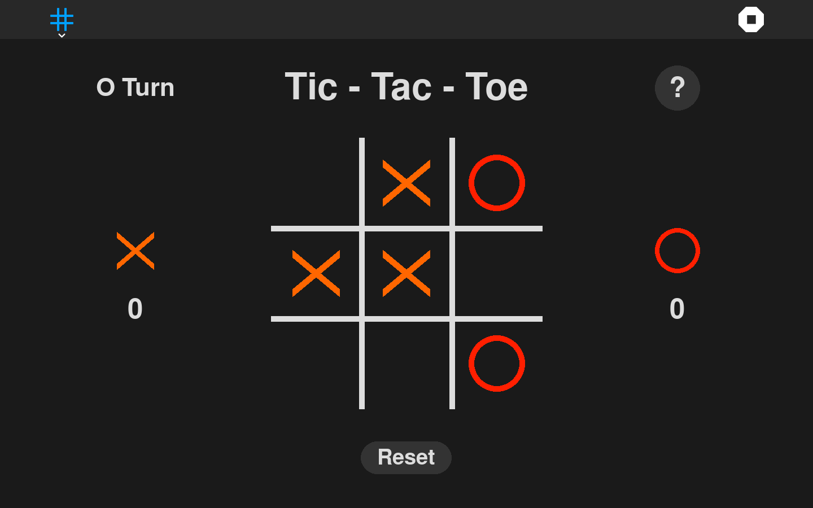

What is this?
=============

Tic-Tac-Toe is a two-player abstract strategy game for the Sugar desktop.



The players take turns marking the spaces in a three-by-three grid with X or O. The player who succeeds in placing three of their marks in a horizontal, vertical, or diagonal row is the winner. 


How to use?
===========

Tic Tac Toe can be run on the Sugar desktop. Please refer to;

* [How to Get Sugar on sugarlabs.org](https://sugarlabs.org/),
* [How to use Sugar](https://help.sugarlabs.org/)

How to run?
=================

Dependencies:- 
- Python >= 3.10
- PyGObject >= 3.42
- PyGame >= 2.5
  
These dependencies need to be manually installed on Debian, Ubuntu and Fedora distributions.


**Running outside Sugar**


- Install the dependencies

- Clone the repo and run -
```
git clone https://github.com/sugarlabs/tictactoe.git
cd tictactoe
python main.py
```

**Running inside Sugar**

- Open Terminal activity and change to the Tic Tac Toe activity directory
```
cd activities\Tic-Tac-Toe.activity
```
- To run
```
sugar-activity3 .
```